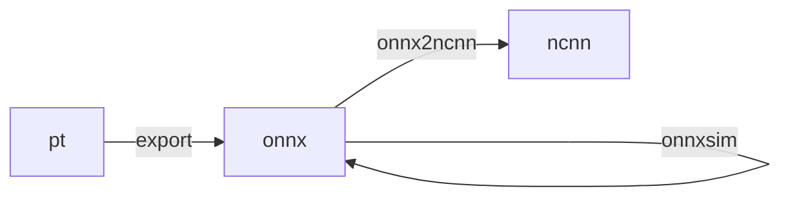

>   完整操作

1.   `python export.py --weight _wt`
2.   [`python -m onnxsim _model.onnx _model-sim.onnx`]
3.   `python onnx2ncnn _.onnx`

Notes for YoloV5 deployment to Android

> using [NCNN](https://github.com/Tencent/ncnn) framework

simple demo proj(ncnn) reference:<https://github.com/nihui/ncnn-android-yolov5/>

and PyTorch demo reference:<https://github.com/pytorch/android-demo-app/tree/master/ObjectDetection>

## Model Conversion

NCNN model files: .bin .param

PyTorch(.pt) -> onnx --onnx2ncnn-->ncnn
<https://github.com/Tencent/ncnn/wiki/use-ncnn-with-pytorch-or-onnx>

> PyTorch(.pt) --official tool(._export)-->.onnx--[onnxsim](https://github.com/daquexian/onnx-simplifier)-->.onnx--onnx2ncnn-->ncnn(.bin/.param)

onnxsim:`python -m onnxsim _model.onnx _model-sim.onnx`

## demo-project

clone [YoloV5 demo project](https://github.com/nihui/ncnn-android-yolov5/)

using Android Studio to import the project after extracting the zip

download needed
- SDK:29.0.2
- NDK:23.1.7779620(the last when writing)
- Android Platform 24

cmake tools for build